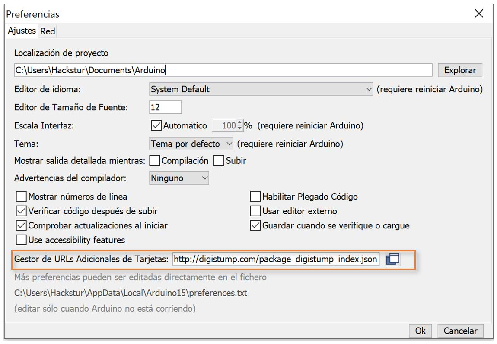
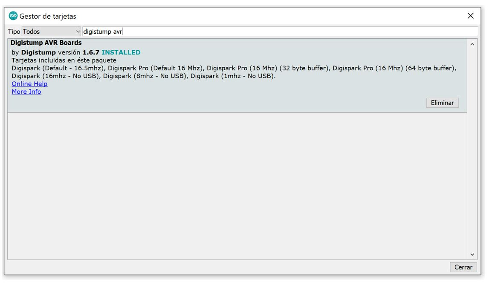
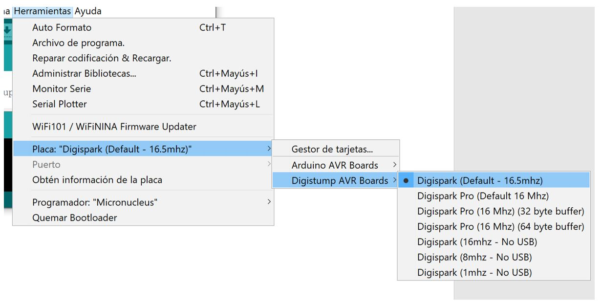

<!------------------- HEADER SECTION -------------------------->
<header>
 <h1 align="center"><strong> d｡◕‿↼｡bづ </strong><br/>Digispark Utils</h1>
  <!-- BADGET BUTTONS -->

</header>
<p></p> <!-- BLANK PARAGRAPH TO FIX HTML HEADER IN GITHUB PAGES TEMPLATE -->
<!------------------- END OF HEADER SECTION -------------------->

<!-- INTRODUCTION -->

## 💬 Introduction  

**Digispark Utils** Its my own repository of Digispark stuff.

The main purpose is store Spanish layout fixes in DigisparkKeyboard libraries, and maybe some scripts for fun.

- Pipe character bug ("|") fixed ✔️


> If you want to **improve** this project, please, **read** the [`Contributors section`](#-contribute).


<!-- INSTALLATION  SECTION -->

## 🏭 Installation
There is different things to install in order to make all works right.

### Digispark drivers
1. Download the latest version for your system from this repository:https://github.com/digistump/DigistumpArduino/tree/master/tools

### Arduino IDE board files
1. Download the latest version of Arduino IDE from their website: https://www.arduino.cc/en/main/software
2. Install **Arduino IDE** as the usual way.
3. Set up the URL to download additional boards in **File->Preferences->Additional Board Manager URLs**
  * ***URL:*** http://digistump.com/package_digistump_index.json

4. Download the board file in **Preferences->Board->Boards Manager**
  * Search for "Digistump avr"

5. Setup the board Digispark in Arduino IDE in **Preferences->Board**
  * 

### Digispark Keyboard Library with multiple layout support
1. Download the latest version from this repository: https://github.com/ernesto-xload/DigisparkKeyboard
2. Copy all files in **\src\** folder to your **~\AppData\Local\Arduino15\packages\digistump\hardware\avr\1.6.7\libraries**
3. Include the libraries in your script appending this lines at start (Spanish example)
```
#define kbd_es_es
#include “DigiKeyboard.h”
```

### DigisparkKeyboard fix
1. Copy and replace all files in "DigiKeyboard-Fix" folder to your DigiKeyboard folder in Arduino libraries folder (**~\AppData\Local\Arduino15\packages\digistump\hardware\avr\1.6.7\libraries**)
2. Use as usually

## ‍🔗 Credits/Reference links
- [Arduino Official Website](https://www.arduino.cc/)
- [Ernesto-xload DigisparkKeyboard Library](https://github.com/ernesto-xload/DigisparkKeyboard)
- [Digispark Schematic Datasheet](https://s3.amazonaws.com/digistump-resources/files/97a1bb28_DigisparkSchematic.pdf)
- [Digispark Wiki](http://digistump.com/wiki/digispark)
- [CedArctic Digispark Script Repository](https://github.com/CedArctic/DigiSpark-Scripts)
- [CedArctic digiQuak Repository](https://github.com/CedArctic/digiQuack)
- [USB Rubber Ducky Documentation](https://github.com/hak5darren/USB-Rubber-Ducky/wiki/Duckyscript)
- [Keyboard Usage IDs](https://www.usb.org/sites/default/files/documents/hut1_12v2.pdf)

<!-- CONTRIBUTE -->

## 💎 Contribute
Feel free to send us a message for anything. We'd love to ear about improve!.

Please, have a look at the [Contributor Covenant][contributor covenant].

<!-- TEAM -->

## 🏀 Team  
Only me.

<!-- LICENSE -->
## 🎓 License  
<sub> © 2020 Hackstur </sub>  

This project is released under the terms of the [MIT][license file] license.

<!------------ RELATIVE LINKS ----------->

[license file]: LICENSE  
[contributor covenant]: https://www.contributor-covenant.org/version/1/4/code-of-conduct.htm  
